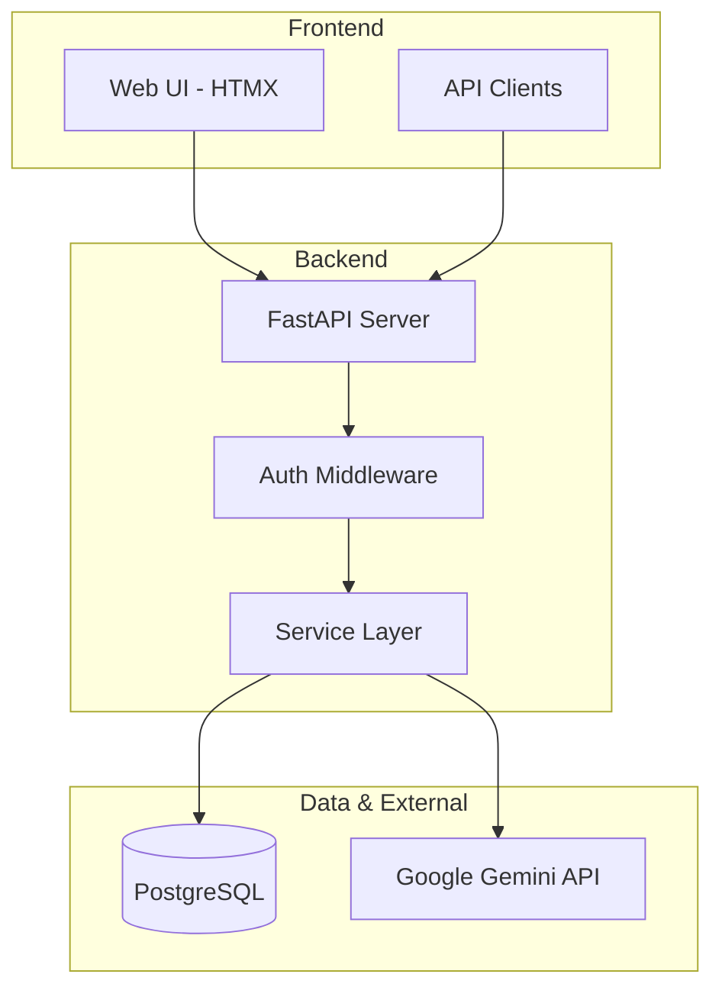
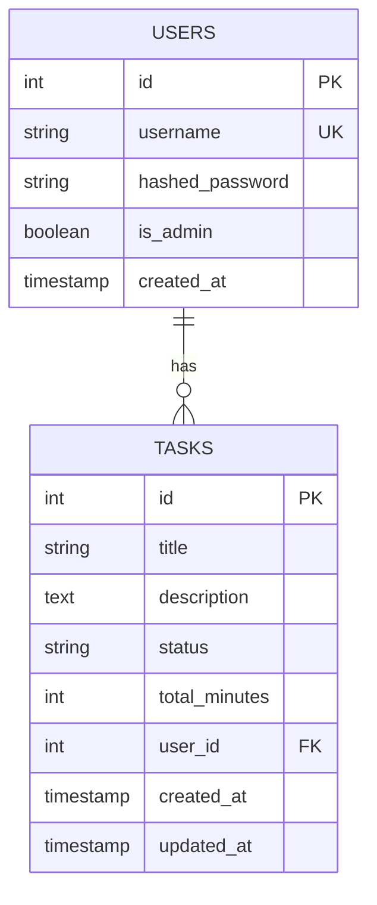

# SprintSync Architecture

FastAPI + PostgreSQL + Gemini AI task management system.

## System Architecture

**Implementation:**
- **Layered Architecture**: Clean separation of concerns
- **Hybrid Authentication**: JWT tokens with cookie/header support
- **AI Integration**: Gemini API with graceful fallbacks
- **Production Ready**: PostgreSQL, Docker, CI/CD

## Database Schema

**Schema Design:**
- **Multi-tenant**: User isolation with foreign keys
- **Audit Trail**: Timestamps for tracking changes
- **Performance**: Indexed queries for fast lookups
- **Scalability**: PostgreSQL for production workloads

## Technology Stack

- **Backend**: FastAPI + Python 3.10
- **Database**: PostgreSQL + SQLAlchemy + Alembic
- **Frontend**: HTMX + Tailwind CSS
- **AI**: Google Gemini 2.5 Flash
- **Deployment**: Docker + Docker Compose
- **CI/CD**: GitHub Actions
- **Monitoring**: Structured logging + Prometheus metrics 