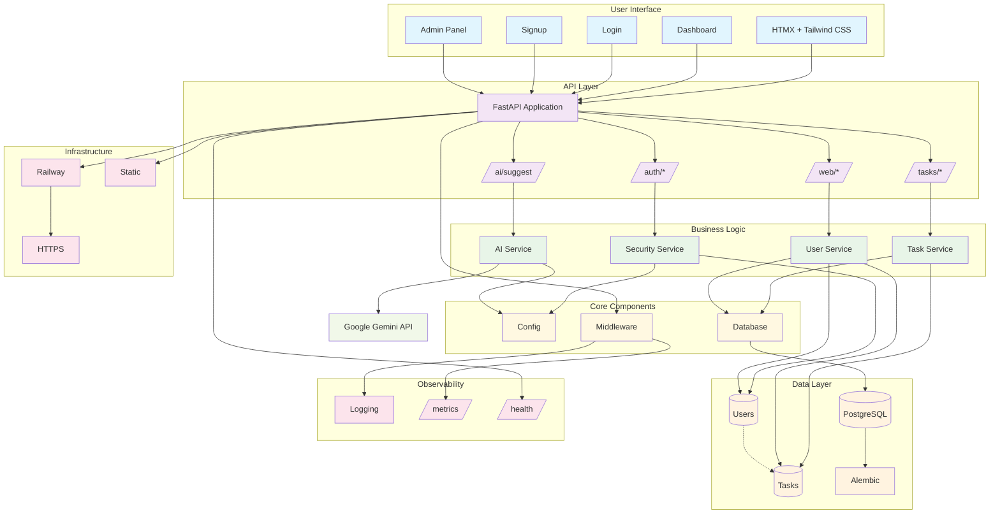

# SprintSync Architecture

## Table of Contents
- [My Approach](#my-approach)
- [System Architecture](#system-architecture)
- [Technology Stack](#technology-stack)
- [Key Architectural Decisions](#key-architectural-decisions)
- [Database Schema](#database-schema)
- [Security Implementation](#security-implementation)
- [Scalability Considerations](#scalability-considerations)
- [Deployment](#deployment)
- [Monitoring & Observability](#monitoring--observability)
- [Performance Optimizations](#performance-optimizations)
- [Error Handling Strategy](#error-handling-strategy)
- [Testing Strategy](#testing-strategy)

## My Approach

I built SprintSync as a task management system with AI integration. The architecture focuses on real-world concerns: authentication, observability, deployment, and user experience.

## System Architecture



## Technology Stack

### Backend
- **FastAPI**: Chose this for async support, automatic Swagger UI docs, and Pydantic validation. The performance is excellent and the developer experience is unmatched.
- **SQLAlchemy + Alembic**: Industry standard ORM with proper migration support. I wanted ACID compliance and complex query capabilities.
- **PostgreSQL**: Production-ready database with proper indexing and transaction support.

### Frontend
- **HTMX**: This was a calculated risk. I wanted to show I can think outside the box. HTMX gave me real-time updates without the complexity of a SPA. Built the entire UI in 2 days.
- **Tailwind CSS**: Rapid prototyping and consistent design. The utility-first approach is just faster for building interfaces.
- **Jinja2**: Server-side templating that works seamlessly with HTMX.

### AI Integration
- **Google Gemini**: Chose this over OpenAI because of the free tier and good performance. The API is straightforward and handles task generation well.
- **Fallback Logic**: Built proper error handling for when AI calls fail.

### Infrastructure
- **Railway**: Zero-config deployment with automatic HTTPS and database provisioning.
- **Prometheus Metrics**: Application metrics and health monitoring.


## Key Architectural Decisions

### 1. Hybrid Authentication
**Decision**: JWT with dual cookie/header support
**Why**: Web users benefit from seamless cookie-based auth, API users get flexible header-based auth. Stateless design means no server-side session storage.
**Implementation**: Created two auth functions - `get_current_user` for API requests and `get_current_user_web` for web requests.

📎 See `app/core/security.py` for dual-mode auth logic

### 2. Service Layer Pattern
**Decision**: Clean separation between API routes and business logic
**Why**: Makes testing easier, allows for code reuse, and keeps the API layer thin.
**Result**: Each service handles its own domain logic, making the codebase maintainable.

📎 See `app/services/` for business logic implementation

### 3. HTMX Over React
**Decision**: Server-side rendering with HTMX instead of client-side SPA
**Why**: Faster development velocity, better SEO, simpler state management. For a task management tool, the interactivity trade-off is acceptable.
**Trade-off**: Less interactive than a SPA, but more performant and easier to build.

**HTMX Flow Example:**
- `dashboard.html` triggers `<button hx-post="/tasks/{id}/status">`
- Backend returns partial HTML (Jinja2 template)
- HTMX swaps the target div without reloading the page
- Real-time updates without SPA complexity

### 4. Structured Observability
**Decision**: Comprehensive logging and metrics from day one
**Why**: Production software needs observability for debugging and monitoring.
**Implementation**: Per-request logging with user context, Prometheus metrics, and proper error handling.

## Database Schema

Simple two-table design:
- **Users**: id, username, hashed_password, is_admin, created_at
- **Tasks**: id, title, description, status, total_minutes, user_id (FK), created_at, updated_at

Relationship: Users have many Tasks (one-to-many)

## Security Implementation

### JWT Token Management
- **Token Storage**: HttpOnly cookies for web, Authorization headers for API
- **Token Expiration**: 24-hour tokens with proper validation
- **Password Security**: Bcrypt hashing with proper salt rounds

### Role-Based Access Control
- **Admin Users**: Special privileges for system overview and user management
- **User Isolation**: Users can only access their own tasks
- **API Protection**: All endpoints require authentication

## Scalability Considerations

### Current Architecture
- **Monolithic Design**: Single FastAPI application for simplicity
- **Database**: Single PostgreSQL instance with proper indexing
- **Caching**: No caching layer yet, but designed for easy addition

### Future Scalability
- **Microservices**: Service layer pattern makes extraction straightforward
- **Database**: Can easily add read replicas or sharding
- **Caching**: Redis can be added for session storage and query caching
- **Load Balancing**: Stateless design allows horizontal scaling

## Deployment

Deployed on Railway with:
- **FastAPI App**: Python application with automatic deployment
- **PostgreSQL**: Managed database with persistent storage
- **External Services**: Google Gemini API for AI features

**Railway Configuration:**
- Automatic HTTPS/SSL certificates
- Environment variable management
- Database provisioning and backups
- Health check monitoring

📎 See `Dockerfile` for container configuration

## Monitoring & Observability

### Metrics Available
- **Request Count**: Total requests per endpoint
- **Error Rate**: Failed requests and error types
- **Response Time**: Latency distribution

**Example Prometheus Metrics:**
```
# HELP requests_total Total number of requests
# TYPE requests_total counter
requests_total 1250

# HELP errors_total Total number of errors
# TYPE errors_total counter
errors_total 23

# HELP app_uptime_seconds Application uptime in seconds
# TYPE app_uptime_seconds gauge
app_uptime_seconds 86400
```

📎 See `/metrics` endpoint for live metrics

### Logging Strategy
- **Structured Logs**: JSON format with consistent fields
- **Request Correlation**: Each request gets a unique ID
- **User Context**: User ID included in all logs
- **Error Tracking**: Full stack traces on exceptions

**Example Log Format:**
```json
{
  "timestamp": "2024-01-15T10:30:00Z",
  "level": "info",
  "logger": "app.main",
  "method": "POST",
  "path": "/tasks/",
  "user_id": 1,
  "latency_ms": 45,
  "status_code": 201
}
```

📎 See `app/main.py` for logging configuration

## Performance Optimizations

### Database
- **Indexes**: Proper indexing on user_id, status, and created_at
- **Queries**: Optimized queries with proper joins
- **Connection Pooling**: SQLAlchemy connection pool management

### Frontend
- **HTMX**: Minimal JavaScript, server-side rendering
- **CSS**: Tailwind purged for production builds
- **Caching**: Browser caching for static assets

## Error Handling Strategy

### API Errors
- **HTTP Status Codes**: Proper status codes (400, 401, 403, 404, 422, 500)
- **Error Responses**: Consistent error message format
- **Validation**: Pydantic validation with clear error messages

### Frontend Errors
- **Graceful Degradation**: UI handles API failures gracefully
- **User Feedback**: Clear error messages and loading states
- **Retry Logic**: Automatic retries for transient failures

## Testing Strategy

### Unit Tests
- **Service Layer**: Business logic testing
- **Model Validation**: Pydantic model testing
- **Authentication**: JWT token validation

### Integration Tests
- **API Endpoints**: Full request/response testing
- **Database Operations**: CRUD operation testing
- **Authentication Flow**: Login/logout testing

 